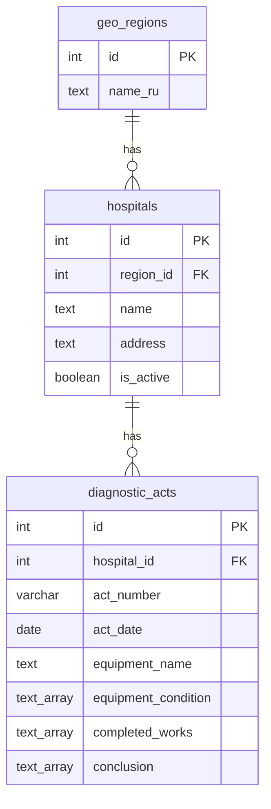

# Больницы и акты диагностики (PostgreSQL)

> **Назначение:** хранение медучреждений (привязка к региону) и актов технического обслуживания / ремонта.  
> **Статус:** миграции `004`–`005`; CRUD больниц и сохранение актов через API.

---

## 1. ER-диаграмма



---

## 2. Таблица `hospitals`

| Колонка | Тип | Описание |
|---------|-----|----------|
| `id` | `SERIAL PK` | |
| `region_id` | `INT FK → geo_regions` | Субъект РФ |
| `name` | `TEXT NOT NULL` | Наименование |
| `address` | `TEXT` | Адрес |
| `is_active` | `BOOLEAN DEFAULT true` | |
| `created_at`, `updated_at` | `TIMESTAMPTZ` | |

Индексы: `hospitals_region_id_idx`, `hospitals_active_idx`.

---

## 3. Таблица `diagnostic_acts`

Поля соответствуют парсеру DOCX ([diagnostic-import.md](./diagnostic-import.md)).

| Колонка | Тип |
|---------|-----|
| `hospital_id` | `INT FK → hospitals` |
| `act_number` | `VARCHAR(50)` |
| `act_date` | `DATE` |
| `act_title` | `TEXT` |
| `equipment_name`, `equipment_model`, `serial_number` | `TEXT` / `VARCHAR` |
| `customer`, `customer_address`, `work_type`, `basis` | `TEXT` |
| `equipment_condition`, `completed_works`, `conclusion` | `TEXT[]` |
| `created_at`, `updated_at` | `TIMESTAMPTZ` |

Дубликаты актов **разрешены** (unique constraint не используется).

---

## 4. Миграции

| Файл | Содержание |
|------|------------|
| `database/migrations/004_hospitals_and_diagnostic_acts.sql` | DDL таблиц |
| `database/migrations/005_hospitals_acts_dml_for_app.sql` | `GRANT` для `ng_app` |

```bash
./database/scripts/migrate.sh
```

---

## 5. API

См. [api-backend.md](./api-backend.md):

- `/api/hospitals` — CRUD
- `/api/diagnostic/acts` — POST (сохранение), GET (список по `hospital_id`)

---

## 6. Связанные файлы

| Путь | Роль |
|------|------|
| `backend/src/services/hospitals.service.ts` | CRUD больниц |
| `backend/src/services/diagnostic-acts.service.ts` | Сохранение и чтение актов |
| `backend/src/routes/hospitals.routes.ts` | HTTP-маршруты больниц |
| `backend/src/routes/diagnostic.routes.ts` | parse + acts |
| `src/app/hospitals/hospitals.component.*` | Управление больницами по региону |
| `src/app/diagnostic/diagnostic-import.component.*` | Импорт и сохранение |
| `src/app/diagnostic/hospital-acts.component.*` | Просмотр актов по больнице |

---

## 7. История изменений

| Дата | Версия | Изменение |
|------|--------|-----------|
| 2026-06-20 | 0.1 | Таблицы `hospitals`, `diagnostic_acts`; API и UI сохранения/просмотра |
| 2026-06-20 | 0.2 | Страница `/hospitals` — добавление и удаление больниц по региону |
