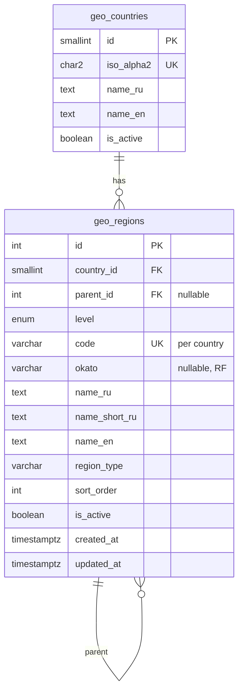

# Справочник регионов (PostgreSQL) — спецификация для AI

> **Назначение:** единый источник правды для агентов и разработчиков при проектировании API, миграций, сидов и UI выбора региона.  
> **Проект:** `ng-easy-office` — Angular 21 + Taiga UI (фронт), Node.js REST API (`backend/`), PostgreSQL.  
> **Статус схемы (география):** миграции `001`–`003`; сид регионов — **89** записей; CRUD — [api-backend.md](./api-backend.md). Больницы/акты — миграции `004`–`005`, [database-hospitals-acts.md](./database-hospitals-acts.md).

---

## 1. Контекст и цели

| Требование | Решение |
|------------|---------|
| Хранить регионы России | Субъекты РФ (`federal_subject`) с официальными кодами |
| Возможны регионы за рубежом | Таблица `geo_countries` + те же `geo_regions` с привязкой к стране |
| Иерархия в будущем | `parent_id` + `level` (страна → субъект → район/город) |
| Справочник, не операционные данные | Мало записей, частые чтения, редкие правки через админку/миграции |

**Не смешивать** с адресами ФИАС/КЛАДР: эта схема — **логический справочник регионов** для фильтров, отчётов, настроек офиса. При интеграции с ФИАС добавлять отдельное поле `fias_guid` или связующую таблицу.

---

## 2. Подключение к БД (локально)

| Параметр | Значение по умолчанию |
|----------|------------------------|
| СУБД | PostgreSQL 18+ (проверено: 18.4 Homebrew) |
| База | `donetsk_test` |
| Хост | `localhost` |
| Порт | `5432` |
| Пользователь | системный пользов ОС или из `.env` (в репозитории секреты не хранить) |

```bash
psql -d donetsk_test
```

**Для AI:** перед созданием таблиц убедиться, что база существует (`psql -l | grep donetsk_test`). Пароли и роли не документировать в git — только в локальном `backend/.env` (см. `backend/.env.example`, файл в `.gitignore`).

---

## 3. Модель данных

### 3.1 ER-диаграмма (логическая)

> Полная ER-диаграмма приложения (все домены): [database-er-diagram.md](./database-er-diagram.md).



### 3.2 Таблица `geo_countries`

Страны для привязки регионов. Россия — первая запись при сиде.

| Колонка | Тип | Ограничения | Описание |
|---------|-----|-------------|----------|
| `id` | `SMALLSERIAL` | PK | |
| `iso_alpha2` | `CHAR(2)` | NOT NULL, UNIQUE | ISO 3166-1 alpha-2 (`RU`, `KZ`, …) |
| `iso_alpha3` | `CHAR(3)` | UNIQUE, nullable | ISO 3166-1 alpha-3 (`RUS`) |
| `name_ru` | `TEXT` | NOT NULL | «Россия» |
| `name_en` | `TEXT` | nullable | `Russian Federation` |
| `is_active` | `BOOLEAN` | NOT NULL, DEFAULT `true` | Скрывать в UI при `false` |

### 3.3 Перечисление `geo_region_level`

| Значение | Смысл | Пример |
|----------|--------|--------|
| `country` | Страна как узел дерева (опционально) | Россия |
| `federal_subject` | Субъект РФ / аналог первого уровня за рубежом | Московская область, Bavaria |
| `administrative` | Район, город, муниципалитет (резерв) | Городской округ |

### 3.4 Таблица `geo_regions`

| Колонка | Тип | Ограничения | Описание |
|---------|-----|-------------|----------|
| `id` | `SERIAL` | PK | |
| `country_id` | `SMALLINT` | NOT NULL, FK → `geo_countries` | |
| `parent_id` | `INT` | FK → `geo_regions`, nullable | Родитель в иерархии; для субъектов РФ — `NULL` или страна |
| `level` | `geo_region_level` | NOT NULL | Уровень в дереве |
| `code` | `VARCHAR(20)` | NOT NULL, UNIQUE с `country_id` | Стабильный код: **ISO 3166-2** для РФ (`RU-MOW`, `RU-MOS`) |
| `okato` | `VARCHAR(11)` | nullable | ОКАТО (только РФ, при необходимости) |
| `name_ru` | `TEXT` | NOT NULL | Полное наименование |
| `name_short_ru` | `TEXT` | nullable | Краткое («Москва», «Свердловская обл.») |
| `name_en` | `TEXT` | nullable | Для интернационализации |
| `region_type` | `VARCHAR(50)` | nullable | Тип субъекта (см. §3.5) |
| `sort_order` | `INT` | nullable | Порядок в выпадающих списках |
| `is_active` | `BOOLEAN` | NOT NULL, DEFAULT `true` | |
| `created_at` | `TIMESTAMPTZ` | NOT NULL, DEFAULT `now()` | |
| `updated_at` | `TIMESTAMPTZ` | NOT NULL, DEFAULT `now()` | |

**Инварианты:**

- `UNIQUE (country_id, code)` — код уникален в рамках страны.
- `CHECK (parent_id IS NULL OR parent_id <> id)` — без самоссылки.
- Для субъектов РФ: `level = 'federal_subject'`, `country_id` = Россия, `code` вида `RU-XXX` по ISO 3166-2:RU.

### 3.5 Значения `region_type` (субъекты РФ)

Использовать **латинские slug** в БД; отображаемые подписи — в UI/i18n.

| `region_type` | По-русски |
|---------------|-----------|
| `republic` | Республика |
| `krai` | Край |
| `oblast` | Область |
| `federal_city` | Город федерального значения |
| `autonomous_oblast` | Автономная область |
| `autonomous_okrug` | Автономный округ |
| `federal_territory` | Федеральная территория (при появлении в перечне) |

За рубежом — свои типы (`state`, `province`, `canton`, …) по мере добавления стран.

---

## 4. DDL (миграция 001)

Файл для применения: `database/migrations/001_geo_regions.sql` (создать при первой миграции).

```sql
-- 001_geo_regions.sql
-- Справочник стран и регионов для ng-easy-office / donetsk_test

BEGIN;

CREATE TABLE geo_countries (
    id          SMALLSERIAL PRIMARY KEY,
    iso_alpha2  CHAR(2) NOT NULL UNIQUE,
    iso_alpha3  CHAR(3) UNIQUE,
    name_ru     TEXT NOT NULL,
    name_en     TEXT,
    is_active   BOOLEAN NOT NULL DEFAULT TRUE
);

CREATE TYPE geo_region_level AS ENUM (
    'country',
    'federal_subject',
    'administrative'
);

CREATE TABLE geo_regions (
    id              SERIAL PRIMARY KEY,
    country_id      SMALLINT NOT NULL REFERENCES geo_countries (id),
    parent_id       INT REFERENCES geo_regions (id) ON DELETE RESTRICT,
    level           geo_region_level NOT NULL,
    code            VARCHAR(20) NOT NULL,
    okato           VARCHAR(11),
    name_ru         TEXT NOT NULL,
    name_short_ru   TEXT,
    name_en         TEXT,
    region_type     VARCHAR(50),
    sort_order      INT,
    is_active       BOOLEAN NOT NULL DEFAULT TRUE,
    created_at      TIMESTAMPTZ NOT NULL DEFAULT NOW(),
    updated_at      TIMESTAMPTZ NOT NULL DEFAULT NOW(),
    CONSTRAINT geo_regions_country_code_uq UNIQUE (country_id, code),
    CONSTRAINT geo_regions_no_self_parent CHECK (
        parent_id IS NULL OR parent_id <> id
    )
);

CREATE INDEX geo_regions_country_id_idx ON geo_regions (country_id);
CREATE INDEX geo_regions_parent_id_idx ON geo_regions (parent_id) WHERE parent_id IS NOT NULL;
CREATE INDEX geo_regions_level_idx ON geo_regions (level);
CREATE INDEX geo_regions_active_idx ON geo_regions (is_active) WHERE is_active = TRUE;

COMMENT ON TABLE geo_countries IS 'Справочник стран';
COMMENT ON TABLE geo_regions IS 'Иерархический справочник регионов (субъекты РФ и др.)';
COMMENT ON COLUMN geo_regions.code IS 'ISO 3166-2 для РФ (RU-XXX) или внутренний код для других стран';

COMMIT;
```

**Применение:**

```bash
psql -d donetsk_test -f database/migrations/001_geo_regions.sql
```

---

## 5. Начальные данные (сид)

### 5.1 Страна

```sql
INSERT INTO geo_countries (iso_alpha2, iso_alpha3, name_ru, name_en)
VALUES ('RU', 'RUS', 'Россия', 'Russian Federation');
```

### 5.2 Субъекты РФ

- Ожидаемое количество: **89** субъектов (актуальный перечень уточнять по официальным источникам на дату сида).
- Источник кодов: [ISO 3166-2:RU](https://en.wikipedia.org/wiki/ISO_3166-2:RU) (`RU-AD`, `RU-AL`, …).
- Файл сида: `database/seeds/002_russia_federal_subjects.sql` (пересборка: `python3 database/scripts/generate_russia_seed.py`).
- **Для AI:** не выдумывать коды; 83 субъекта — строго ISO 3166-2:RU; 6 дополнительных — только коды из сида (`RU-CR`, `RU-SEV`, `RU-DON`, `RU-LUG`, `RU-ZPO`, `RU-KHE`).

```bash
psql -d donetsk_test -f database/seeds/002_russia_federal_subjects.sql
```

Пример одной строки:

```sql
INSERT INTO geo_regions (
    country_id, parent_id, level, code, name_ru, name_short_ru, region_type, sort_order
)
SELECT
    c.id,
    NULL,
    'federal_subject',
    'RU-MOW',
    'г. Москва',
    'Москва',
    'federal_city',
    77
FROM geo_countries c
WHERE c.iso_alpha2 = 'RU';
```

### 5.3 Зарубежные регионы (будущее)

1. `INSERT` в `geo_countries` (например, `KZ`, `BY`).
2. `INSERT` в `geo_regions` с `level = 'federal_subject'` (или локальный эквивалент) и кодами по ISO 3166-2 или национальному классификатору.

---

## 6. Типовые запросы

**Активные субъекты РФ для select в UI:**

```sql
SELECT r.id, r.code, r.name_ru, r.name_short_ru, r.region_type
FROM geo_regions r
JOIN geo_countries c ON c.id = r.country_id
WHERE c.iso_alpha2 = 'RU'
  AND r.level = 'federal_subject'
  AND r.is_active = TRUE
ORDER BY r.sort_order NULLS LAST, r.name_ru;
```

**Регион по коду:**

```sql
SELECT * FROM geo_regions r
JOIN geo_countries c ON c.id = r.country_id
WHERE c.iso_alpha2 = 'RU' AND r.code = 'RU-SVE';
```

**Дочерние узлы (когда появятся `administrative`):**

```sql
SELECT * FROM geo_regions WHERE parent_id = $1 AND is_active = TRUE ORDER BY sort_order, name_ru;
```

---

## 7. Связь с фронтендом (ng-easy-office)

| Аспект | Рекомендация |
|--------|----------------|
| API | [api-backend.md](./api-backend.md): `GET /api/regions?country_iso=RU&level=federal_subject` |
| Модель TS | `GeoRegion { id, code, nameRu, nameShortRu?, regionType?, countryIso2 }` |
| UI | Taiga UI combobox/autocomplete; кэшировать справочник в `signal`/сервисе |
| i18n | Пока `name_ru`; при `name_en` — переключатель локали |
| FK в других таблицах | `region_id INT REFERENCES geo_regions(id)` — не дублировать название региона в бизнес-таблицах |

---

## 8. Правила для AI-агентов

Общее правило проекта: **все изменения документировать** — см. [README.md](./README.md#обязательные-правила).

1. **Не менять** устоявшиеся `code` после публикации — только deprecate через `is_active = false`.
2. Новые страны — сначала `geo_countries`, потом регионы.
3. Миграции — только в `database/migrations/`, сиды — в `database/seeds/`; порядок — [database-policy.md](./database-policy.md).
4. После DDL проверять: `\d geo_regions`, `\d geo_countries`, количество субъектов РФ.
5. **Документировать каждое изменение** в этом файле: актуализировать §§ 3–7 при смене схемы/сида; строка в §9; статус в шапке; при новых файлах — §10.

---

## 9. История изменений документа

| Дата | Версия | Изменение |
|------|--------|-----------|
| 2026-06-01 | 1.0 | Первичная спецификация: `geo_countries`, `geo_regions`, enum уровней, DDL, сиды РФ |
| 2026-06-01 | 1.1 | Сид `002_russia_federal_subjects.sql`: 83 ISO + 6 внутренних кодов |
| 2026-06-01 | 1.2 | Правило: все изменения документировать (ссылка на `docs/ai/README.md`) |
| 2026-06-01 | 1.3 | Ссылка на `database-policy.md` (роли, журнал миграций) |
| 2026-06-01 | 1.4 | REST CRUD: `api-backend.md` |
| 2026-07-26 | 1.5 | Актуализированы шапка и §2: backend в репозитории, ссылка на домен hospitals/acts |
| 2026-07-26 | 1.6 | Ссылка на единую ER-диаграмму приложения в [database-er-diagram.md](./database-er-diagram.md) |

---

## 10. Связанные файлы (план)

| Путь | Назначение |
|------|------------|
| `docs/ai/database-regions.md` | Этот документ |
| `database/migrations/001_geo_regions.sql` | DDL (создать по §4) |
| `database/seeds/002_russia_federal_subjects.sql` | Сиды: 89 субъектов РФ |
| `database/scripts/generate_russia_seed.py` | Генератор сида (пересборка SQL) |
